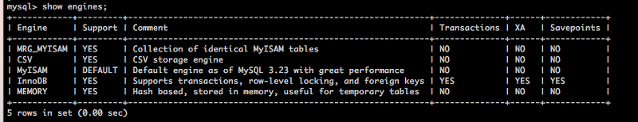

## MySQL DB-Link 구현을 위한 FEDERATED 엔진 활성화 및 테이블 생성

### 1. 설치되어 있는 엔진 확인

### 2. 엔진을 사용할 수 있도록 설치

### 3. FEDERATED 엔진의 설치여부 확인

### 4. 엔진 사용 가능 하도록 my.cnf 수정

### 5. 엔진의 상태를 확인 합니다.

----------------
## 

